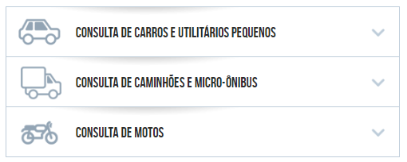
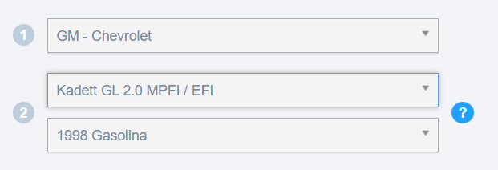
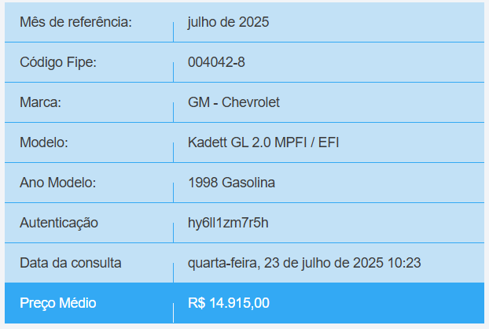
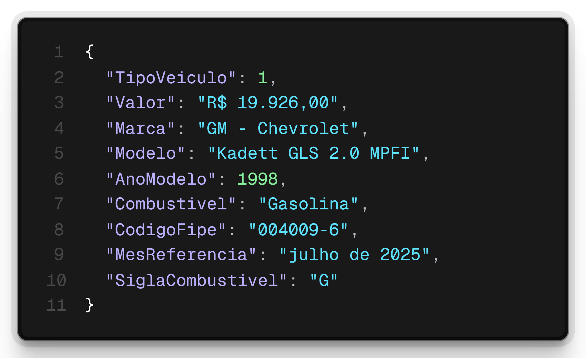

# Objetivo
- Implementar uma aplicação para consultar o valor médio de veículos (carros, motos ou caminhões) de acordo com a tabela FIPE, que pode ser acessada através [desse site](https://veiculos.fipe.org.br/).

## Fluxo no site da tabela FIPE
- A consulta aos valores dos veículos pelo site tem o seguinte fluxo:
- Primeiramente é necessário escolher o tipo do veículo: carro, moto ou caminhão.

- Depois disso, é necessário preencher a MARCA, MODELO e ANO para consulta.

- Por fim, é exibida a avaliação apenas daquele ano escolhido.

## 🏁 Objetivos do projeto

- O objetivo do projeto é ter um fluxo similar ao que é feito no site, porém com algumas melhorias.
- Criaremos um projeto Spring com linha de comando, utilizando a classe Scanner para fazer interações com o usuário via terminal.
- O usuário digite irá digitar o tipo de veículo desejado (carro, caminhão ou moto).
- Feito isso, serão listadas todas as marcas daquele tipo de veículo, solicitando que o usuário escolha uma marca pelo código.
- Após essa escolha, serão listadas todos os modelos de veículos daquela marca.
- O usuário irá digitar um trecho do modelo que ele quer visualizar, por exemplo **KADETT**.
- Serão listadas apenas os modelos que tiverem a palavra **KADETT** no nome.
- Usuário escolherá um modelo específico pelo código e, diferente do site, já listaremos as avaliações para **TODOS** os anos disponíveis daquele modelo.

- Para realização do projeto, será feito o consumo de uma API, documentada [nesse link](https://deividfortuna.github.io/fipe/).

- De acordo com o escolhido (carro, moto, ou caminhão) vamos fazer uma chamada a um dos endpoints abaixo para buscar as marcas:
    - https://parallelum.com.br/fipe/api/v1/carros/marcas
    - https://parallelum.com.br/fipe/api/v1/motos/marcas
    - https://parallelum.com.br/fipe/api/v1/caminhoes/marcas

- O retorno dessa requisição será uma lista com código e marca desejada. Caso o usuário queira por exemplo fazer uma consulta a modelos de carros da GM - Chevrolet, que possui o código 23, terá que fazer uma nova requisição para o endpoint:
    - https://parallelum.com.br/fipe/api/v1/carros/marcas/23/modelos

- Feito isso, irá escolher um código de modelo, por exemplo esse **Kadett GLS 2.0 MPFI**, representado pelo código 1084. Então deverá fazer uma terceira requisição para o endpoint:
    - https://parallelum.com.br/fipe/api/v1/carros/marcas/23/modelos/1084/anos

- Para saber a avaliação para cada ano disponível, teremos que fazer requisições pelo código por ano, onde obteremos um retorno similar ao que é mostrado abaixo:
    - https://parallelum.com.br/fipe/api/v1/carros/marcas/23/modelos/1084/anos/1998-1

    

- Para podermos exibir na aplicação as avaliações de todos os anos para esse modelo, será necessário trabalhar com as coleções e estruturas de repetição para poder exibir já todos as avaliações de todos os anos para o nosso usuário.
- Será utilizada a biblioteca Jackson para a desserialização dos dados.

